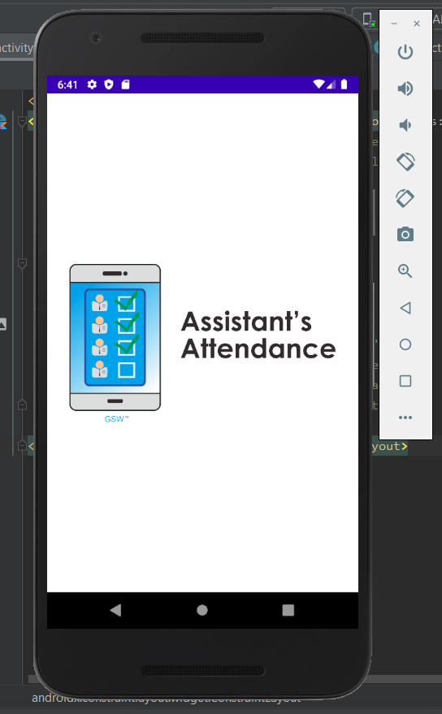
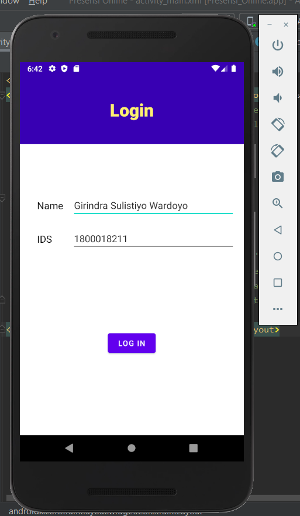
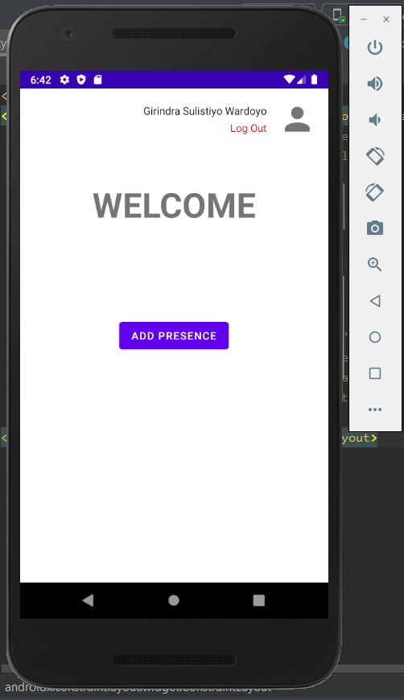
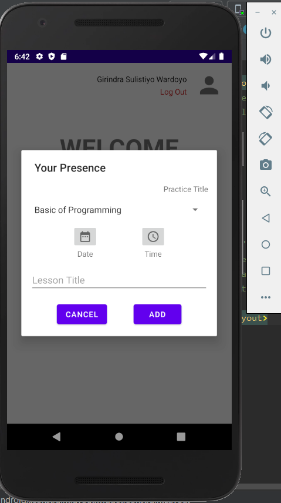
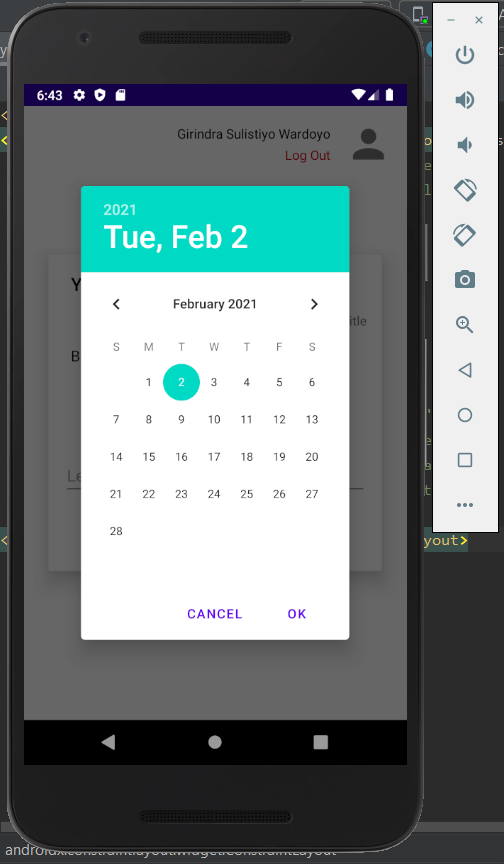
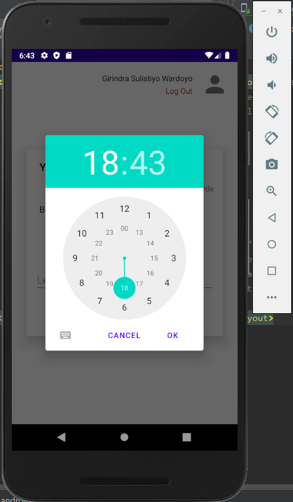
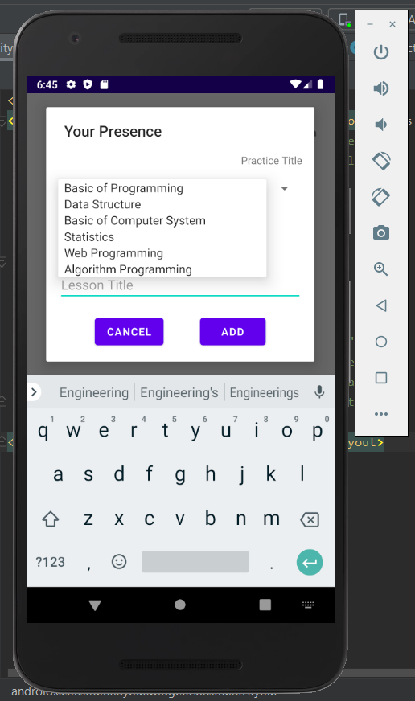
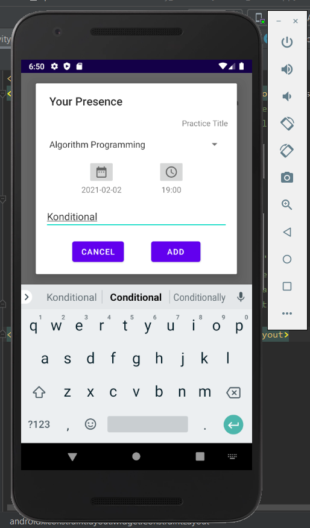
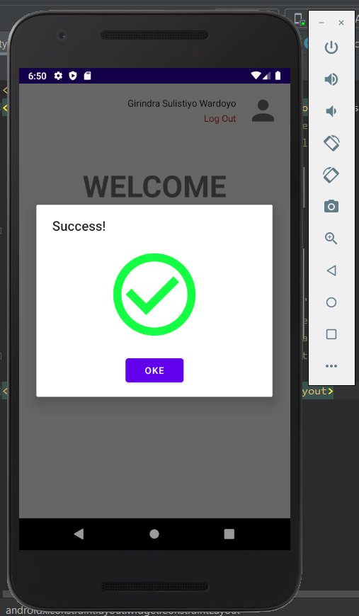
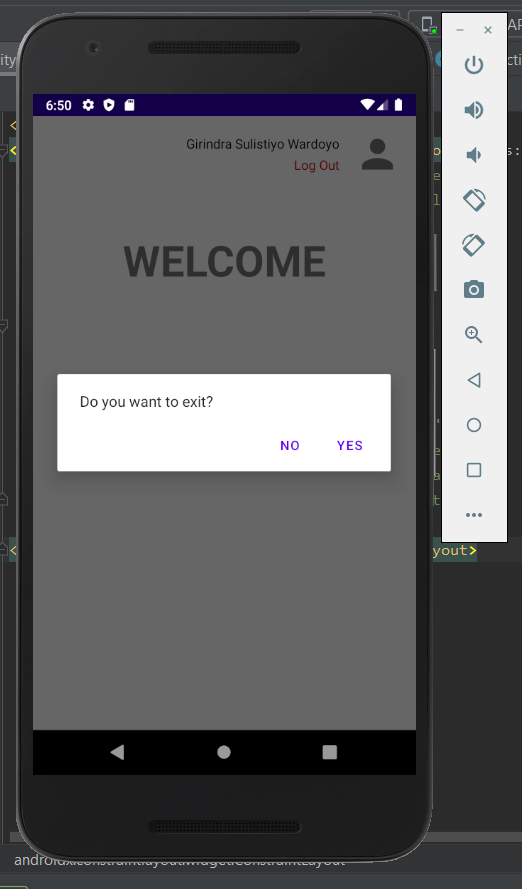

# RKS-Project-Task-assistant-
Name  : Girindra Sulistiyo Wardoyo
Student ID : 1800018211

Class International

Home Work of System Requirements Engineering (RKS(Rekayasa Kebutuhan Sistem) in Indonesian)
This project is for my lecture which the subject is "Systems Requirements Engineering".
This project is not using database, and this project is about application for assistant of practice in some Department of University.
The Application is developed using Android Studio

The Front End that I built is match with the wireframe design, workflow, and documentation requirements that I have been created before UAS. The following is the link to the previous UTS folder which contains workflows, wireframes, and required documentation:

https://drive.google.com/drive/folders/1uKr9LrZ9ewexarDpGFZISRPV65Lr_dId?usp=sharing

Below is the Screenshot of the application

